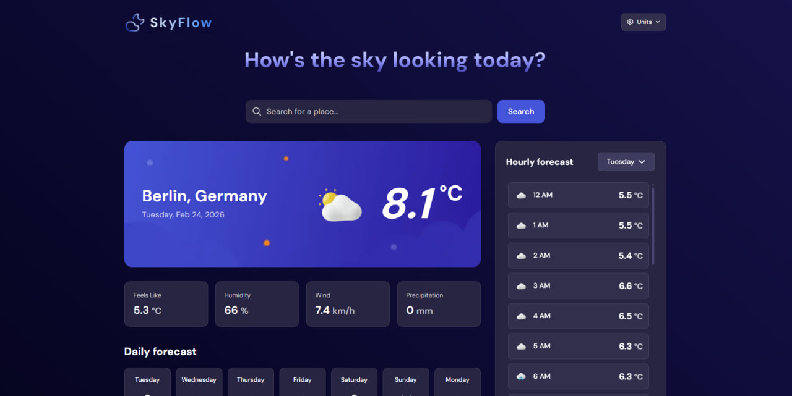

[](README.ru.md)

# SkyFlow - weather forecast app

[](https://nextjs.org)
[](https://reactjs.org)
[](https://www.typescriptlang.org)
[](https://tailwindcss.com)
[](https://feature-sliced.design)

[](https://vitest.dev)
[](https://sky-flow-weather.vercel.app/)
[](https://github.com/snowicide/sky-flow/actions)
[](https://groq.com)
[](https://prettier.io)
[](https://commitlint.js.org)
[](https://opensource.org/licenses/MIT)



**A weather tracking app with a modern stack and a focus on performance.**

[**_Live Demo_**](https://sky-flow-weather.vercel.app/)

## Stack:

- **Framework:** Next.js 15
- **Styling:** Tailwind CSS ^4, Recharts
- **Data Fetching:** TanStack Query (React Query) v5
- **State Management:** Zustand
- **API:** Open-Meteo (Geocoding and Forecast)
- **AI:** Groq (llama 3.3 70B) + Vercel AI SDK (streaming)
- **Testing:** Vitest, MSW (Mock Service Worker)
- **Code Quality:** TypeScript, Eslint, Commitlint, Husky, Zod
- **Infrastructure:** Upstash Redis (Ratelimit)

## Features:

- **Smart Search:** City search with error handling
- **Settings:** the ability to change units of measurement
- **Detailed forecast:** current weather, hourly and weekly forecast with chart
- **Data storage:** Storing history and favorite cities, unit settings in localStorage
- **UX/UI:** responsive design and using pulsating skeleton components
- **Reliability:** full typing, zod-validation of external API and related types, protected URL parameters
- **Testing:** Unit and integration test coverage: ~90% (Statements) and ~80% (Branches)
- **Github Actions:** Automatic checking of secret keys, TS errors, linting, test coverage, and final build upon `pull_request`
- **FSD validation:** strict adherence to the FSD architecture with automatic checking via ESlint plugins
- **Performance:** Memoized hooks and components
- **AI assistant:** generating unique location facts and weather tips. Response streaming for UX, spam protection via Upstash Redis

## Structure:

<details>
<summary><b>Feature-Sliced Design (FSD) structure</b></summary>

### Layers:

- `src/app/` - routing, which is imported from `pages-flat/`
- `src/shared/` - reusable shared hooks, helper functions, global mock factories and MSW (`lib/`), types and schemas (`types/`), `public/` image exports (`assets/`), shared UI components (`ui/`), shared error handling, raw request, custom AppError (`api/`), global constants (`config/`)
- `src/entities/` - the heart of the application with API requests along with DTO's (`api/`), local helper functions (`lib/`), core hooks, mappers, types/schemas (`model/`)
- `src/features/` - interactive features with which the user actively interacts
- `src/widgets/` - self-contained widgets
- `src/pages-flat/` - main pages

### Segments:

- `api/` - external requests
- `assets/` - images exported directly from `public/`
- `config/` - configuration files
- `lib/` - helper functions
- `types/` - types and schemas
- `model/` - data model
- `ui/` - UI components

</details>

## Starting the server:

1. **Clone the repository:**
   ```bash
   git clone https://github.com/snowdelion/sky-flow.git .
   ```
2. **Install dependencies:**
   ```bash
   npm install
   ```
3. **Set up environment variables:**
   Copy the file template and add your API keys by following the links inside the file:
   ```bash
   cp .env.example .env.local
   ```
4. **Start the development server:**
   ```bash
   npm run dev
   ```
   **_Open [http://localhost:3000](http://localhost:3000) in your browser._**

## Available scripts:

<details>
<summary><b>View all commands</b></summary>

### Production build

Build and start the production server:

```bash
npm run build
npm run start
```

### Testing (Vitest)

Run tests once:

```bash
npm run test:run
```

Run tests with final coverage report:

```bash
npm run test:cov
```

### Code quality

Run TypeScript type checking, Prettier format checking and ESLint linting:

```bash
npm run validate
```

</details>

---

- Project - solving a task with a prepared design and adding new ideas and details
- Design: https://www.frontendmentor.io/challenges/weather-app-K1FhddVm49
